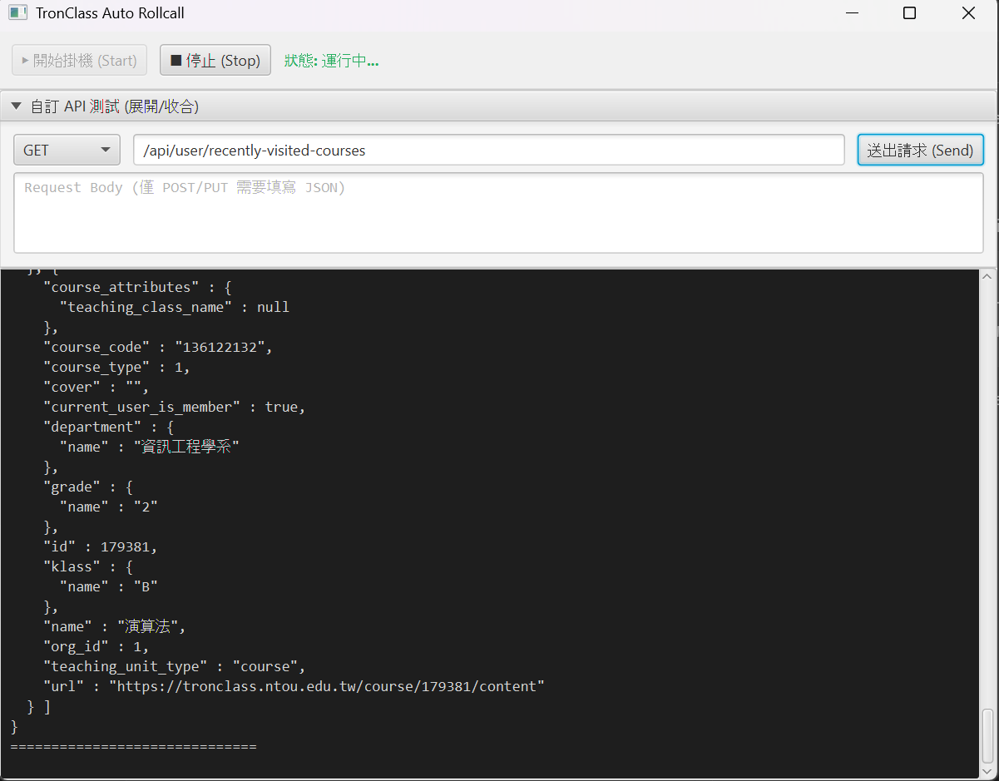

# Tronclass api clawer
school code, java final project


## Requirements
- java 17

## features:
1. Easy to test api
- pre-login
- very good ai-gen-ui

2. Wait for rollcall to start and automatically answer
- number !
- radar ?
3. use SNS to notifitons
- telegram
- discord

## Quick Start
1. Download the latest release with your OS from the releases page

2. Extract the zip file

3. Fill in the information in the config.yaml
```
account:
  user: 'YOUR_STUDENT_ID'
  passwd: 'YOUR_PASSWORD'
```

4. Double click the jar file to run.

